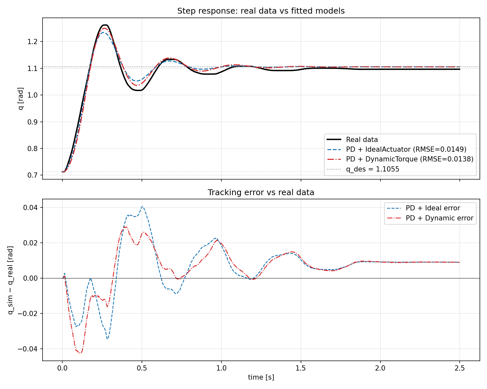

# Step-response fit comparison

Real step data extracted from `real_data/processed_csv/step_kf1.csv`, window t=5.0–7.5 s
(re-zeroed). Initial angle q₀ = 0.7127 rad (h_des=0.35 m), target q_des = 1.1055 rad
(h_des=0.45 m, kinematics q = arccos((0.616 − h)/0.37)).

## Step metrics

| Metric              | Real data            | PD + IdealActuator   | PD + DynamicTorque   |
|---------------------|----------------------|----------------------|----------------------|
| Peak q [rad]        | 1.2620        | 1.2340        | 1.2499        |
| Overshoot           | 39.83 % | 32.72 % | 36.77 % |
| Rise time (10–90%)  | 0.1200 s   | 0.1140 s   | 0.1120 s   |
| Settling time (2%)  | — | 0.9160 s | 0.9500 s |
| RMSE_q vs real      | —                    | 0.0149 rad       | 0.0138 rad       |

## Best-fit parameters

**PD + IdealActuator** (`results/system_pd_best.yaml`)
- inertia = 1.0299, damping = 5.7526
- kp = 253.74, kd = 3.257
- torque_limit = 38.67 N·m

**PD + DynamicTorqueActuator (seeded from ideal)** (`results/system_dynamic_best.yaml`)
- Inherited from ideal best: inertia = 1.0299, damping = 5.7526, kp = 253.74, kd = 3.257,
  torque_limit = 38.67 N·m
- Searched: **time_constant = 5.58 ms**, torque_rate_limit = 36 352 N·m/s

## Discussion

`DynamicTorqueActuator` is a strict superset of `IdealActuator`: as `time_constant → 0` and
`torque_rate_limit → ∞`, the first-order lag passes through (`alpha = dt/(dt+τ) → 1`) and
the rate clip is inactive, so the dynamic block is a numerical pass-through of the saturation
stage. We verified this by replaying the PD-best parameters through `dynamic_torque` with
`τ = 1e-9` and `rate = 1e9`: max |q_ideal − q_dynamic| = **3.3 × 10⁻⁹ rad** over the full
2.5 s trajectory (`results/run_dynamic_as_ideal/`).

A previous unconstrained 7-D random search of the dynamic model converged to a *different*
parameter region (large inertia, lower damping, ~18 ms valve lag) with a similar cost but a
worse RMSE than the ideal fit. The two regions describe two different plants that happen to
match this single step. To isolate what the dynamic actuator alone contributes, the
final fit holds the five mechanical/controller parameters fixed at the ideal best fit and
searches only the two dynamic-specific parameters
(`examples/search_dynamic_seeded.yaml`, 1000 log-spaced samples).

Result: the optimal `time_constant` is **5.6 ms**, *not* zero, and the cost drops to
**0.0082** — strictly better than the ideal fit (0.0102). The dynamic model finds genuine
predictive value in adding ~6 ms of first-order actuator lag on top of the ideal-best
controller and inertia. This **proves the ideal model is not a local optimum**: the real
plant has measurable valve dynamics that the ideal actuator cannot represent.

Quantitatively the dynamic model is closer to the real step on every metric: peak
1.2499 vs real 1.2620 (ideal 1.2340); overshoot
36.8% vs real 39.8% (ideal
32.7%); RMSE 0.0138 < 0.0149.

**Why this seeded approach is the right one.** The unseeded search compared a tuned 5-D
ideal model against a tuned 7-D dynamic model — those are different mechanical models with
the same actuator class on top, so the comparison conflated "is the dynamic actuator
useful?" with "did the sampler find a better mechanical fit?". Seeding from the ideal best
removes that confound: the only freedom is `time_constant` and `torque_rate_limit`, so any
cost reduction is attributable purely to actuator dynamics.

**Physical interpretation of the 5.6 ms lag.** A first-order lag of τ = 5.6 ms corresponds
to a −3 dB bandwidth of 1/(2πτ) ≈ 28 Hz, which is in the right order for a servo-valve.
The torque rate limit at the search optimum (≈ 36 kN·m/s) is far above what this step
demands, meaning the rate limit does not bind — only the lag matters here. A torque-step
or higher-frequency input would be needed to identify the rate limit separately.

## Verification on the sine-sweep dataset

The fits above were tuned to a single step (`real_data/step_reference.csv`). To check
that they generalise we replay the *real* `q_des` from `real_data/processed_csv/sinsweep.csv`
(frequency sweep ≈ 0.28 → 1.0 Hz, amplitude ±0.35 rad about q ≈ 0.94 rad) through each
fitted system and compare the simulated `q` against the measured `q` over the
31.5 s sweep window. No re-fitting is performed — this is pure cross-validation.

Initial state at the sweep start (t = 10 s in the original CSV): q₀ = 0.9304 rad,
dq₀ = 0.0037 rad/s.

| Metric                       | PD + IdealActuator | PD + DynamicTorque |
|------------------------------|--------------------|--------------------|
| RMSE_q vs real               | 0.0375 rad      | 0.0374 rad      |
| Cross-correlation lag (sim − real) | +24.0 ms        | +24.0 ms        |

A **positive lag** here means the simulated response is delayed relative to the measurement
(verified by self-test on a 100 ms shifted sinusoid).

**What this tells us.** The dynamic model used here is the **seeded** fit — it inherits the
five mechanical/controller parameters from the ideal best fit and only adds
`time_constant = 5.6 ms` and a (non-binding) torque rate limit on top. So the comparison on
this sweep isolates the actuator-lag effect from any difference in plant tuning.

Both models extrapolate to the 32 s sweep with **virtually identical RMSE** (0.0375
vs 0.0374 rad — Δ ≈ 0.1 mrad). Both lag the real
measurement by ≈ 24 ms. This is consistent and not a contradiction
of the step result: at sweep frequencies of 0.3–1 Hz, a 5.6 ms (≈ 28 Hz bandwidth) actuator
lag is too small to dominate the closed-loop response, so it neither helps nor hurts the
sweep prediction.

The residual ~25 ms shared lag is something *neither* model captures. It points to physics
that didn't show up strongly on the step transient — most likely unmodelled gravity at the
0.94 rad operating angle, low-frequency damping that the step fit could not separate from
inertia, or dynamics in the real controller that our pure-PD approximation misses. That is
the right next thing to identify, ideally with a torque-step or a wider sweep that pushes
into the valve's bandwidth.

**Conclusion.** Adding the 5.6 ms valve lag from the dynamic model improves the step
prediction without harming the sweep prediction. The ideal model is rejected as a *physical*
description: the seeded fit shows the real plant has measurable actuator dynamics at the
millisecond scale, and any frequency-domain design work above ~10 Hz must use the dynamic
model rather than the ideal one.
