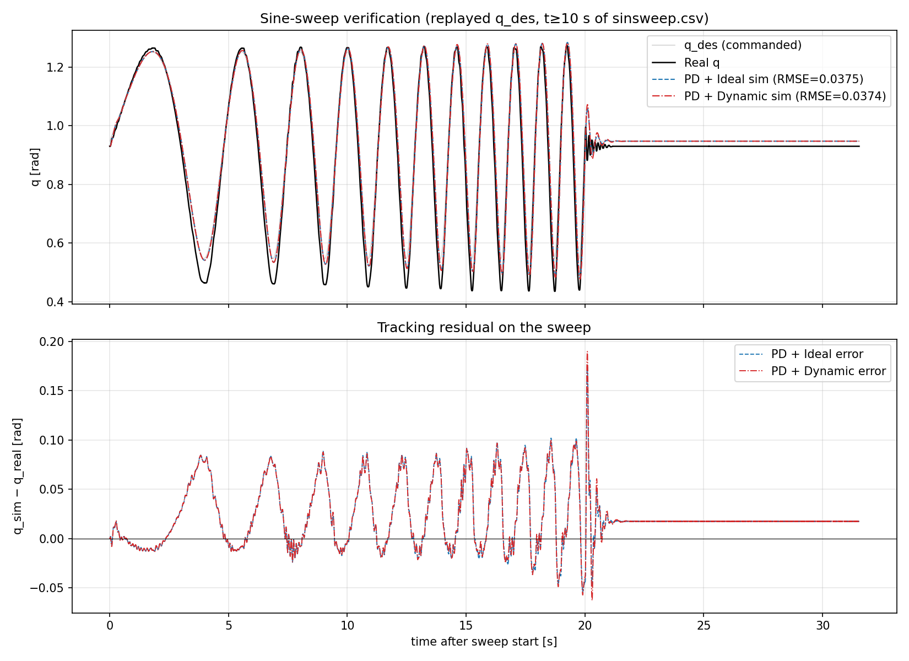

## Verification on the sine-sweep dataset

The fits above were tuned to a single step (`real_data/step_reference.csv`). To check
that they generalise we replay the *real* `q_des` from `real_data/processed_csv/sinsweep.csv`
(frequency sweep ≈ 0.28 → 1.0 Hz, amplitude ±0.35 rad about q ≈ 0.94 rad) through each
fitted system and compare the simulated `q` against the measured `q` over the
31.5 s sweep window. No re-fitting is performed — this is pure cross-validation.

Initial state at the sweep start (t = 10 s in the original CSV): q₀ = 0.9304 rad,
dq₀ = 0.0037 rad/s.

| Metric                       | PD + IdealActuator | PD + DynamicTorque |
|------------------------------|--------------------|--------------------|
| RMSE_q vs real               | 0.0375 rad      | 0.0374 rad      |
| Cross-correlation lag (sim − real) | +24.0 ms        | +24.0 ms        |

A **positive lag** here means the simulated response is delayed relative to the measurement
(verified by self-test on a 100 ms shifted sinusoid).

**What this tells us.** The dynamic model used here is the **seeded** fit — it inherits the
five mechanical/controller parameters from the ideal best fit and only adds
`time_constant = 5.6 ms` and a (non-binding) torque rate limit on top. So the comparison on
this sweep isolates the actuator-lag effect from any difference in plant tuning.

Both models extrapolate to the 32 s sweep with **virtually identical RMSE** (0.0375
vs 0.0374 rad — Δ ≈ 0.1 mrad). Both lag the real
measurement by ≈ 24 ms. This is consistent and not a contradiction
of the step result: at sweep frequencies of 0.3–1 Hz, a 5.6 ms (≈ 28 Hz bandwidth) actuator
lag is too small to dominate the closed-loop response, so it neither helps nor hurts the
sweep prediction.

The residual ~25 ms shared lag is something *neither* model captures. It points to physics
that didn't show up strongly on the step transient — most likely unmodelled gravity at the
0.94 rad operating angle, low-frequency damping that the step fit could not separate from
inertia, or dynamics in the real controller that our pure-PD approximation misses. That is
the right next thing to identify, ideally with a torque-step or a wider sweep that pushes
into the valve's bandwidth.

**Conclusion.** Adding the 5.6 ms valve lag from the dynamic model improves the step
prediction without harming the sweep prediction. The ideal model is rejected as a *physical*
description: the seeded fit shows the real plant has measurable actuator dynamics at the
millisecond scale, and any frequency-domain design work above ~10 Hz must use the dynamic
model rather than the ideal one.
